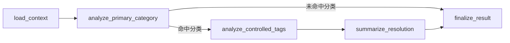

# converger_agent 最终设计文档

## 1. 目标与边界

`converger_agent` 是一套新的投诉工单分析 agent。

它和旧系统的关系是：

- 继续复用原始工单表 `raw_complaint_tickets`
- 不再依赖旧分类体系直接运行
- 不和旧结果表做兼容映射
- 运行时判断范围完全受控，不允许 AI 自由生成分类或标签

当前版本的目标只有两个：

1. 基于一条原始工单，稳定输出固定结构的分析结果
2. 为后续写库和处理建议沉淀提供一套新的、收敛的事实源

---

## 2. 本轮对话的最终结论

本轮收敛过程可以概括为 5 步：

1. 放弃直接沿用旧 `complaint_taxonomy_validator` 的宽输出模式
2. 把新 agent 明确定义为固定输出 7 项结果的受控 agent
3. 重设计新的分类体系 `category_v2`
4. 把分类体系和 4 组标签常量全部改为 JSON 事实源
5. 用真实工单 + 真实模型持续验证，直到 `category_v2.json` 达到可用状态

最终已经确认的事实：

- 分类运行时事实源是 [category_v2.json](D:/project/FullStack/voc/voc_agent/converger_agent/data/category_v2.json)
- 标签运行时事实源是：
  - [request_tags.json](D:/project/FullStack/voc/voc_agent/converger_agent/data/request_tags.json)
  - [emotion_tags.json](D:/project/FullStack/voc/voc_agent/converger_agent/data/emotion_tags.json)
  - [risk_tags.json](D:/project/FullStack/voc/voc_agent/converger_agent/data/risk_tags.json)
  - [product_tags.json](D:/project/FullStack/voc/voc_agent/converger_agent/data/product_tags.json)
- 汇总说明和验证结果记录在：
  - [manifest.json](D:/project/FullStack/voc/voc_agent/converger_agent/data/manifest.json)
  - [validation_rounds.json](D:/project/FullStack/voc/voc_agent/converger_agent/data/validation_rounds.json)

最新验证结果：

- 基于 `category_v2.json`
- 使用真实模型 `Qwen3-Max`
- 10 条真实工单样本
- 一级命中 `10/10`
- 二级命中 `10/10`
- 叶子命中 `10/10`

验证报告：

- [taxonomy_v2_json_round8_report.md](D:/project/FullStack/voc/docs/converger_design/taxonomy_v2_json_round8_report.md)
- [taxonomy_v2_json_round8_report.json](D:/project/FullStack/voc/docs/converger_design/taxonomy_v2_json_round8_report.json)

这意味着：

- 不再继续改一级、二级结构
- 当前 `category_v2.json` 已可直接作为 `converger_agent` 的分类事实源
- 下一步应该是把这套 JSON 接入 agent 代码和数据库落库链路

---

## 3. AGENT 总定义

`converger_agent` 的职责是：

- 读取一条原始工单的完整信息
- 在明确给定的分类和标签范围内做判断
- 输出固定的 7 项分析结果

固定输出项：

- `primary_category`
- `request_tag`
- `emotion_tag`
- `risk_tag`
- `line_category`
- `product_tag`
- `resolution_summary`

其中各项产生方式已经固定：

- `primary_category`
  - 必须来自 `category_v2.json`
- `request_tag`
  - 必须来自 `request_tags.json`
- `emotion_tag`
  - 必须来自 `emotion_tags.json`
- `risk_tag`
  - 必须来自 `risk_tags.json`
- `product_tag`
  - 必须来自 `product_tags.json`
- `line_category`
  - 当前直接来自原始工单字段 `line_category`
  - 不要求 AI 重判
- `resolution_summary`
  - 可选项
  - 只针对已回单工单做处理结果或处理方法总结

说明：

- `resolution_summary` 仍然属于 agent 的分析输出
- 但它不进入工单结果主表
- 它只作为后续“分类处理建议沉淀”的输入材料

这个 agent 不是自由总结工单，而是把原始工单收敛成一份固定结构的标准结果。

---

## 4. AGENT 节点流程

建议按下面 5 个节点实现：

### 4.1 `load_context`

职责：

- 读取 `raw_complaint_tickets` 中的原始工单
- 加载 `category_v2.json`
- 加载 4 个标签常量 JSON

输出：

- `ticket`
- `category_options`
- `request_tag_options`
- `emotion_tag_options`
- `risk_tag_options`
- `product_tag_options`

### 4.2 `analyze_primary_category`

职责：

- 从 `category_v2.json` 中只选 1 个叶子分类

约束：

- 必须输出 `level1_code / level2_code / leaf_code`
- 不允许输出 JSON 之外的分类
- 优先遵守 `category_v2.json` 中的 `disambiguation_rules`

如果这一层没有可信结果：

- 直接结束
- 本工单不继续做后续标签分析

### 4.3 `analyze_controlled_tags`

职责：

- 在主分类成立的前提下，分析：
  - `request_tag`
  - `emotion_tag`
  - `risk_tag`
  - `product_tag`
- 同时直接保留 `line_category`

约束：

- 每项只能从对应 JSON 常量里选 1 个
- 不允许自由生成新值
- `line_category` 当前直接取原始工单值

### 4.4 `summarize_resolution`

职责：

- 读取处理相关字段
- 如果能总结出可复用的处理结果或方法，则输出 `resolution_summary`

说明：

- 这是可选输出
- 只在已回单、已有处理信息时才做
- 没有内容时允许为空

### 4.5 `finalize_result`

职责：

- 整理成最终标准输出
- 生成统一状态字段

建议状态：

- `completed`
- `skipped_no_category`

---

## 5. AI 分析 7 项数据时的字段依据

### 5.1 `primary_category`

重点参考字段：

- `complaint_phenomenon`
- `biz_content`
- `appeal_biz_type`
- `return_reason`
- `prov_dispatch_desc`
- `prov_process_desc`
- `city_process_desc`
- `process_dept`
- `flow_depts`

选择范围：

- [category_v2.json](D:/project/FullStack/voc/voc_agent/converger_agent/data/category_v2.json)

分析要点：

- 只能选 1 个叶子分类
- 必须遵守 JSON 中的歧义规则

### 5.2 `request_tag`

重点参考字段：

- `complaint_phenomenon`
- `biz_content`
- `appeal_biz_type`
- `biz_category`

选择范围：

- [request_tags.json](D:/project/FullStack/voc/voc_agent/converger_agent/data/request_tags.json)

分析要点：

- 只能选 1 个
- 必须来自常量

### 5.3 `emotion_tag`

重点参考字段：

- `biz_content`

选择范围：

- [emotion_tags.json](D:/project/FullStack/voc/voc_agent/converger_agent/data/emotion_tags.json)

分析要点：

- 只判断用户情绪
- 不承担问题类型判断

### 5.4 `risk_tag`

重点参考字段：

- `ticket_type`
- `customer_star`
- `repeat_count`
- `urge_count`
- `oscillation_count`
- `satisfaction_score`
- `complaint_phenomenon`
- `complaint_source`

选择范围：

- [risk_tags.json](D:/project/FullStack/voc/voc_agent/converger_agent/data/risk_tags.json)

分析要点：

- 只选 1 个主要风险标签
- 默认值应允许为普通工单

### 5.5 `line_category`

重点参考字段：

- `line_category`

选择范围：

- 当前直接复用原始工单值

分析要点：

- 第一版不要求 AI 重判
- 后续如有需要，可再为每个分类补标准条线说明

### 5.6 `product_tag`

重点参考字段：

- `dispute_product_name`
- `biz_content`
- `complaint_phenomenon`
- `return_reason`

选择范围：

- [product_tags.json](D:/project/FullStack/voc/voc_agent/converger_agent/data/product_tags.json)

分析要点：

- 只选 1 个
- 必须来自常量

### 5.7 `resolution_summary`

重点参考字段：

- `return_reason`
- `prov_dispatch_desc`
- `prov_process_desc`
- `city_process_desc`
- `process_dept`
- `flow_depts`

选择范围：

- 无固定常量

分析要点：

- 只针对已回单工单
- 只输出简洁、可复用的处理结果或处理方法总结

---

## 6. 运行时事实源设计

`converger_agent` 的运行时事实源全部放在：

- [data](D:/project/FullStack/voc/voc_agent/converger_agent/data)

当前最小文件集合：

- `category_v2.json`
- `request_tags.json`
- `emotion_tags.json`
- `risk_tags.json`
- `product_tags.json`
- `validation_rounds.json`
- `manifest.json`

其中：

- `category_v2.json`
  - 是分类主事实源
  - 包含 `level1 / level2 / leaves / disambiguation_rules`
- 4 个 `tag JSON`
  - 是受控常量集合
- `validation_rounds.json`
  - 说明这套分类体系经过了哪些轮次的真实验证
- `manifest.json`
  - 说明加载顺序和文件角色

当前结论：

- 运行时优先以 JSON 为准
- 文档说明如果与 JSON 冲突，以 JSON 为准

---

## 7. 数据库设计

这部分只保留当前已经确认的最小设计。

### 7.1 `raw_complaint_tickets`

不重建，不替换。

只新增 1 个字段：

- `converger_agent_status BOOLEAN NOT NULL DEFAULT FALSE`

含义：

- `FALSE`
  - 还没有被新 `converger_agent` 分析过
- `TRUE`
  - 已经被新 `converger_agent` 分析过

说明：

- 这是为了和旧系统分析状态做区分
- 不修改原有业务字段含义

### 7.2 `converger_agent_result`

这是每条工单的分析结果表。

建议字段：

- `id BIGSERIAL PRIMARY KEY`
- `ticket_id VARCHAR(100) NOT NULL`
- `primary_level1_code VARCHAR(100) NOT NULL`
- `primary_level1_name VARCHAR(100) NOT NULL`
- `primary_level2_code VARCHAR(100) NOT NULL`
- `primary_level2_name VARCHAR(100) NOT NULL`
- `primary_leaf_code VARCHAR(100) NOT NULL`
- `primary_leaf_name VARCHAR(100) NOT NULL`
- `request_tag_code VARCHAR(100)`
- `request_tag_name VARCHAR(100)`
- `emotion_tag_code VARCHAR(100)`
- `emotion_tag_name VARCHAR(100)`
- `risk_tag_code VARCHAR(100)`
- `risk_tag_name VARCHAR(100)`
- `product_tag_code VARCHAR(100)`
- `product_tag_name VARCHAR(100)`
- `line_category VARCHAR(255)`
- `model_name VARCHAR(100)`
- `taxonomy_version VARCHAR(50)`
- `status VARCHAR(50) NOT NULL`
- `created_at TIMESTAMP NOT NULL DEFAULT CURRENT_TIMESTAMP`
- `updated_at TIMESTAMP NOT NULL DEFAULT CURRENT_TIMESTAMP`

约束建议：

- `ticket_id` 唯一
- 每条工单只保留 1 条当前结果

说明：

- 这张表只存最终结果
- `ticket_id` 直接关联 `raw_complaint_tickets.ticket_id`
- 不存候选分类
- 不存自由发挥内容
- 不存 `resolution_summary`
- `taxonomy_version` 用于标识当前使用的 JSON 版本
- 如果 agent 结果是 `skipped_no_category`，不插入这张表

### 7.3 `converger_resolution_summary_atomic`

这是原子处理总结表。

用途：

- 当 agent 在分析完分类和固定标签后
- 如果能从处理字段里抽出一条有复用价值的 `resolution_summary`
- 先把这条总结作为原子记录落下来

这张表的目标不是直接给业务使用，而是：

- 先保留每条工单提炼出的原始处理总结
- 避免过早合并导致信息丢失
- 为后续建议归并提供稳定输入

建议字段：

- `id BIGSERIAL PRIMARY KEY`
- `source_ticket_id VARCHAR(100) NOT NULL`
- `primary_leaf_code VARCHAR(100) NOT NULL`
- `primary_leaf_name VARCHAR(100) NOT NULL`
- `product_tag_code VARCHAR(100)`
- `product_tag_name VARCHAR(100)`
- `request_tag_code VARCHAR(100)`
- `request_tag_name VARCHAR(100)`
- `risk_tag_code VARCHAR(100)`
- `risk_tag_name VARCHAR(100)`
- `emotion_tag_code VARCHAR(100)`
- `emotion_tag_name VARCHAR(100)`
- `line_category VARCHAR(255)`
- `resolution_summary TEXT`
- `model_name VARCHAR(100)`
- `taxonomy_version VARCHAR(50) NOT NULL`
- `agent_version VARCHAR(50)`
- `status VARCHAR(50) NOT NULL DEFAULT 'active'`
- `created_at TIMESTAMP NOT NULL DEFAULT CURRENT_TIMESTAMP`
- `updated_at TIMESTAMP NOT NULL DEFAULT CURRENT_TIMESTAMP`

约束建议：

- `source_ticket_id` 唯一

说明：

- 一条工单不一定能产出 `resolution_summary`
- 一旦产出，先原样沉淀一条
- 不在主写入链路中做硬合并
- 不在主写入链路中做 AI 语义合并

### 7.4 `converger_handling_advice`

这是归并后的处理建议知识表。

用途：

- 从 `converger_resolution_summary_atomic` 中归并出可复用建议
- 面向后续消费场景，提供“分类/产品/诉求 -> 建议”的知识沉淀

适用范围主轴建议为：

- `primary_leaf_code`
- `product_tag_code`
- `request_tag_code`

原因：

- 同一分类下，不同产品可能对应不同处理手法
- 同一分类下，不同诉求可能对应不同处理方向
- `risk_tag`、`emotion_tag` 更适合做辅助条件，不适合作为建议主键主轴

建议字段：

- `id BIGSERIAL PRIMARY KEY`
- `primary_leaf_code VARCHAR(100) NOT NULL`
- `primary_leaf_name VARCHAR(100) NOT NULL`
- `product_tag_code VARCHAR(100)`
- `product_tag_name VARCHAR(100)`
- `request_tag_code VARCHAR(100)`
- `request_tag_name VARCHAR(100)`
- `risk_tag_code VARCHAR(100)`
- `risk_tag_name VARCHAR(100)`
- `emotion_tag_code VARCHAR(100)`
- `emotion_tag_name VARCHAR(100)`
- `line_category VARCHAR(255)`
- `advice_title VARCHAR(255) NOT NULL`
- `advice_content TEXT NOT NULL`
- `applicability_note TEXT`
- `normalized_advice_hash VARCHAR(64) NOT NULL`
- `source_summary_count INT NOT NULL DEFAULT 1`
- `latest_source_ticket_id VARCHAR(100)`
- `status VARCHAR(50) NOT NULL DEFAULT 'active'`
- `created_at TIMESTAMP NOT NULL DEFAULT CURRENT_TIMESTAMP`
- `updated_at TIMESTAMP NOT NULL DEFAULT CURRENT_TIMESTAMP`

约束建议：

- 唯一键建议为：
  - `(primary_leaf_code, COALESCE(product_tag_code, ''), COALESCE(request_tag_code, ''), normalized_advice_hash)`

说明：

- 这张表允许同一分类下存在多条建议
- 如果“分类 + 产品 + 诉求”相同，但建议内容不同，不应数据库层硬合并
- 只有标准化后内容一致，才做去重

关于“同一分类 + 产品 + 诉求相同，但 `resolution_summary` 不同怎么处理”，当前明确结论是：

- 不硬合并
- 不在主链路中做 AI 语义合并
- 先写入 `converger_resolution_summary_atomic`
- 再由后置归并任务决定是否归并进 `converger_handling_advice`

原因：

- 数据库无法可靠判断两条文本是否语义相同
- 在线 AI 合并会拖慢主链路，也容易误伤真实差异
- 两层表结构更稳，也方便后续补人工审核

---

## 8. 当前推荐的实现顺序

1. 在 `raw_complaint_tickets` 新增 `converger_agent_status`
2. 创建 `converger_agent_result`
3. 创建 `converger_resolution_summary_atomic`
4. 创建 `converger_handling_advice`
5. 在 agent 代码里直接从 `voc_agent/converger_agent/data` 加载 JSON
6. 让 `primary_category` 节点先使用 `category_v2.json`
7. 再让 4 个标签节点使用各自 JSON
8. 最后接入落库逻辑

当前不建议做的事：

- 不继续改一级、二级分类结构
- 不把标签改成数据库主数据表
- 不做旧分类到新分类的强制兼容映射
- 不让 AI 输出 JSON 之外的新分类或新标签

---

## 9. 结论

`converger_agent` 当前已经具备以下稳定前提：

- 分类体系已经收敛
- 分类 JSON 已经经过真实样本验证
- 4 组标签常量已经明确
- 数据库最小设计已经确定

所以接下来真正该做的不是继续讨论分类树，而是：

- 按这份文档实现 `voc_agent/converger_agent`
- 让 agent 直接加载这些 JSON
- 然后把结果写入新的结果表和处理建议表
