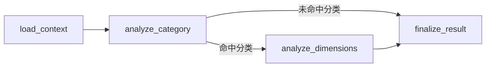

# complaint_taxonomy_converger 设计文档

## 1. AGENT 总定义

`complaint_taxonomy_converger` 的目标是：

- 基于一条原始工单的相关信息
- 在明确给定的选择范围内做判断
- 最终输出这 7 项结果

输出项固定为：

- `primary_category`
- `request_tag`
- `emotion_tag`
- `risk_tag`
- `line_category`
- `product_tag`
- `resolution_summary`

约束如下：

- `primary_category` 必须来自现有四级分类体系 `complaint_category`
- `request_tag` 必须来自 `request_tag` 常量集合
- `emotion_tag` 必须来自 `emotion_tag` 常量集合
- `risk_tag` 必须来自 `risk_tag` 常量集合
- `product_tag` 必须来自 `product_tag` 常量集合
- `line_category` 当前直接来自原始工单，不要求 AI 重判
- `resolution_summary` 是可选项，只针对已回单工单做抽象总结

这个 agent 不是自由总结工单，而是把一条工单收敛成固定结构的数据。

---

## 2. AGENT 节点流程定义

建议按下面 4 个节点组织主链路：



### 2.1 `load_context`

职责：

- 读取原始工单
- 读取 `complaint_category`
- 读取 agent 内部维护的常量集合

输入：

- `ticket_id`

输出：

- `ticket`
- `category_options`
- `request_tag_options`
- `emotion_tag_options`
- `risk_tag_options`
- `product_tag_options`

说明：

- 常量标签先由 agent 内部配置维护
- 当前不单独建 `request/emotion/risk/product` 主数据表

### 2.2 `analyze_category`

职责：

- 先判断这条工单是否能稳定命中一个 `primary_category`

输入：

- `ticket`
- `category_options`

输出：

- `primary_category`
- `category_summary`
- `stop_reason`

规则：

- 只能输出 1 个主分类
- 必须命中 `complaint_category`
- 如果没有可信分类，则流程直接结束

### 2.3 `analyze_dimensions`

职责：

- 在主分类成立的前提下，输出其余 6 项结果

输入：

- `ticket`
- `primary_category`
- 4 类常量选项

输出：

- `request_tag`
- `emotion_tag`
- `risk_tag`
- `line_category`
- `product_tag`
- `resolution_summary`

规则：

- `request/emotion/risk/product` 只能从给定范围内选
- `line_category` 当前直接取原始工单值
- `resolution_summary` 只针对已回单工单输出，没有则为空

### 2.4 `finalize_result`

职责：

- 整理最终标准输出

输出：

- `ticket_id`
- `status`
- `primary_category`
- `request_tag`
- `emotion_tag`
- `risk_tag`
- `line_category`
- `product_tag`
- `resolution_summary`
- `stop_reason`

状态建议：

- `completed`
- `skipped_no_category`

---

## 3. AI 分析 7 项数据时的设计

下面只保留已经确认的判断口径。

### 3.1 `primary_category`

目标：

- 确定这条工单的核心问题类型

重点参考字段：

- `complaint_phenomenon`
- `biz_content`
- `appeal_biz_type`
- `return_reason`
- `prov_dispatch_desc`
- `prov_process_desc`
- `city_process_desc`

需要携带的选择范围：

- 启用中的 `complaint_category` 四级分类体系

分析要点：

- 只能选 1 个分类
- 不允许自由生成新分类
- 如果分类不可信，则整条工单不继续处理

### 3.2 `request_tag`

目标：

- 确定客户当前最主要的诉求

重点参考字段：

- `complaint_phenomenon`
- `biz_content`
- `appeal_biz_type`
- `biz_category`

需要携带的选择范围：

- `request_tag` 常量集合

分析要点：

- 必须从常量中选
- 只选 1 个
- 不允许生成新的诉求标签

当前建议常量：

- `EXPLAIN`: 解释说明
- `REFUND`: 退费
- `CANCEL`: 取消业务
- `RESTORE`: 恢复服务
- `NETWORK_REPAIR`: 网络修复
- `COMPENSATE`: 赔偿补偿
- `APPLY_SERVICE`: 办理业务
- `CHANGE_PLAN`: 变更套餐
- `CONTACT_MANAGER`: 联系客户经理
- `FAST_PROCESS`: 加快处理

当前确认说明：

- `REQUEST` 第一版最终保留 10 个常量
- `NETWORK_REPAIR` 已确认纳入
- `RESTORE` 和 `NETWORK_REPAIR` 的边界暂定为：
  - `RESTORE`: 停机恢复、解限、恢复已中断服务
  - `NETWORK_REPAIR`: 网络质量、故障申告、宽带/信号/网速修复

### 3.3 `emotion_tag`

目标：

- 确定客户当前情绪状态

重点参考字段：

- `biz_content`

需要携带的选择范围：

- `emotion_tag` 常量集合

分析要点：

- 必须从常量中选
- 只选 1 个
- 主要判断用户情绪，不判断问题类型

当前建议常量：

- `CALM`: 平稳
- `UNSATISFIED`: 不满
- `AGITATED`: 激动
- `ANGRY`: 强烈投诉

### 3.4 `risk_tag`

目标：

- 确定工单是否有升级风险，或是否已经是高级投诉工单

重点参考字段：

- `ticket_type`
- `customer_star`
- `repeat_count`
- `urge_count`
- `oscillation_count`
- `satisfaction_score`
- `complaint_phenomenon`
- `complaint_source`

需要携带的选择范围：

- `risk_tag` 常量集合

分析要点：

- 必须从常量中选
- 只选 1 个
- 风险判断要兼顾升级风险和高级投诉识别

当前建议常量：

- `NORMAL`: 正常
- `REPEATED`: 重复投诉
- `ESCALATED`: 升级投诉
- `REGULATORY`: 监管风险
- `PUBLIC_OPINION`: 舆情风险
- `HIGH_VALUE`: 高价值客户
- `BATCH_ISSUE`: 批量问题
- `COMPLIANCE`: 合规风险

### 3.5 `line_category`

目标：

- 确定当前工单所属责任条线

重点参考字段：

- `line_category`

需要携带的选择范围：

- 当前不需要额外范围

分析要点：

- 当前直接复用原始工单中的 `line_category`
- 当前不要求 AI 重判
- 后续如果需要，可基于 `primary_category` 给每个条线增加标准化描述

### 3.6 `product_tag`

目标：

- 确定工单投诉的主要产品或业务对象

重点参考字段：

- `dispute_product_name`
- `biz_content`
- `complaint_phenomenon`
- `return_reason`

需要携带的选择范围：

- `product_tag` 常量集合

分析要点：

- 必须从常量中选
- 只选 1 个
- 这个结果会直接影响后续处理建议

当前建议常量：

- `MOBILE`: 移动业务
- `BROADBAND`: 宽带业务
- `IPTV`: IPTV业务
- `FUSION_PACKAGE`: 融合套餐
- `VALUE_ADDED`: 增值业务
- `WINGPAY`: 翼支付
- `DEVICE`: 终端设备

### 3.7 `resolution_summary`

目标：

- 对已回单工单的处理结果或处理方法做抽象总结

重点参考字段：

- `return_reason`
- `prov_dispatch_desc`
- `prov_process_desc`
- `city_process_desc`
- `process_dept`
- `flow_depts`

需要携带的选择范围：

- 当前不需要固定选项范围

分析要点：

- 这是可选输出
- 只针对已回单工单分析
- 没有明确处理痕迹时允许为空

---

## 4. 常量定义总表

为避免后续实现时重复理解，第一版先把 4 组常量固定如下。

### 4.1 `product_tag`

| code | 中文说明 |
| --- | --- |
| `MOBILE` | 移动业务 |
| `BROADBAND` | 宽带业务 |
| `IPTV` | IPTV业务 |
| `FUSION_PACKAGE` | 融合套餐 |
| `VALUE_ADDED` | 增值业务 |
| `WINGPAY` | 翼支付 |
| `DEVICE` | 终端设备 |

说明：

- 这是当前确认后的第一版最终集合

### 4.2 `request_tag`

| code | 中文说明 |
| --- | --- |
| `EXPLAIN` | 解释说明 |
| `REFUND` | 退费 |
| `CANCEL` | 取消业务 |
| `RESTORE` | 恢复服务 |
| `NETWORK_REPAIR` | 网络修复 |
| `COMPENSATE` | 赔偿补偿 |
| `APPLY_SERVICE` | 办理业务 |
| `CHANGE_PLAN` | 变更套餐 |
| `CONTACT_MANAGER` | 联系客户经理 |
| `FAST_PROCESS` | 加快处理 |

说明：

- 这是当前确认后的第一版最终集合
- `NETWORK_REPAIR` 用于承接故障申告、网络质量、宽带修复、信号和网速修复类诉求

### 4.3 `emotion_tag`

| code | 中文说明 |
| --- | --- |
| `CALM` | 平稳 |
| `UNSATISFIED` | 不满 |
| `AGITATED` | 激动 |
| `ANGRY` | 强烈投诉 |

说明：

- 这是当前确认后的第一版最终集合

### 4.4 `risk_tag`

| code | 中文说明 |
| --- | --- |
| `NORMAL` | 正常 |
| `REPEATED` | 重复投诉 |
| `ESCALATED` | 升级投诉 |
| `REGULATORY` | 监管风险 |
| `PUBLIC_OPINION` | 舆情风险 |
| `HIGH_VALUE` | 高价值客户 |
| `BATCH_ISSUE` | 批量问题 |
| `COMPLIANCE` | 合规风险 |

说明：

- 这是当前确认后的第一版最终集合

---

## 5. 结果结构定义

第一版最终结果建议固定为：

```json
{
  "ticket_id": "string",
  "status": "completed | skipped_no_category",
  "primary_category": {
    "id": 0,
    "code": "string",
    "name": "string"
  },
  "request_tag": {
    "code": "string",
    "name": "string"
  },
  "emotion_tag": {
    "code": "string",
    "name": "string"
  },
  "risk_tag": {
    "code": "string",
    "name": "string"
  },
  "line_category": {
    "value": "string",
    "source": "raw_ticket"
  },
  "product_tag": {
    "code": "string",
    "name": "string"
  },
  "resolution_summary": "string | null",
  "stop_reason": "string | null"
}
```

说明：

- 这是第一版最小结果结构
- 当前不强行加入过多调试字段
- 后续如果要调模型，再补 `confidence`、`reason`、`keyword_evidence`

---

## 6. 简单数据表设计

当前只保留最小必要表设计。

### 5.1 `raw_complaint_tickets`

作用：

- 原始工单事实表

原则：

- 保持不变

### 5.2 `complaint_category`

作用：

- 主分类参考表

原则：

- 直接复用
- 不重建

### 5.3 `ticket_converger_result`

作用：

- 存 `complaint_taxonomy_converger` 的最终输出结果

建议字段：

```sql
create table ticket_converger_result (
    id bigserial primary key,
    ticket_id varchar(100) not null unique,
    primary_category_id bigint null references complaint_category(id) on delete restrict,
    primary_category_code varchar(100) null,
    primary_category_name varchar(200) null,
    request_tag_code varchar(64) null,
    request_tag_name varchar(100) null,
    emotion_tag_code varchar(64) null,
    emotion_tag_name varchar(100) null,
    risk_tag_code varchar(64) null,
    risk_tag_name varchar(100) null,
    line_category varchar(100) null,
    product_tag_code varchar(64) null,
    product_tag_name varchar(100) null,
    resolution_summary text null,
    status varchar(50) not null,
    stop_reason varchar(100) null,
    model_version varchar(100) null,
    created_at timestamp not null default now(),
    updated_at timestamp not null default now()
);
```

设计说明：

- `ticket_id` 对应原始工单
- `primary_category_id` 用于关联现有分类体系
- 其他 4 类标签当前直接存 `code + name`
- `line_category` 当前直接存原始值
- `resolution_summary` 可为空
- 这张表只保存最终收敛结果

---

## 7. 当前结论

当前可以把 `complaint_taxonomy_converger` 简单理解为：

- 先用原始工单信息判断 `primary_category`
- 再输出
  - `request_tag`
  - `emotion_tag`
  - `risk_tag`
  - `line_category`
  - `product_tag`
  - `resolution_summary`
- 最终把结果收敛成一条标准记录

当前确认范围内，不再展开：

- 关键词证据表
- 运行日志表
- 其他派生表
- 旧 `complaint_tag` 体系迁移方案
