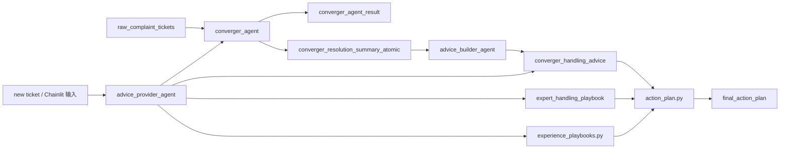

# 当前 Agent 架构

## 背景

项目已经从早期“分类表 + 标签表 + 关键词规则”的数据库驱动方案，收敛为三类 Agent 协作的投诉处理建议链路。

当前事实源包括：

- `raw_complaint_tickets`
- `converger_agent_result`
- `converger_resolution_summary_atomic`
- `converger_handling_advice`
- `expert_handling_playbook`

截至 2026-05-16，远程库已有约 10 万条历史工单分类结果、2.8 万条历史处理摘要、552 条历史归纳建议、62 条专家处理剧本。行数是当天只读核对快照，后续批处理会继续变化。

## Agent 1：converger_agent

职责：

- 读取原始历史工单。
- 在受控分类和标签范围内输出结构化结果。
- 对有回单处理信息的历史工单提炼 `resolution_summary`。

输出：

- `primary_category`
- `request_tag`
- `emotion_tag`
- `risk_tag`
- `product_tag`
- `line_category`
- `resolution_summary`

落库：

- `converger_agent_result`
- `converger_resolution_summary_atomic`
- `raw_complaint_tickets.converger_agent_status`

入口：

- `voc_agent/converger_agent/chain.py`
- `voc_agent/converger_agent/persistence.py`
- `deploy/scripts/run_converger_persist_quiet.py`
- `deploy/scripts/run_converger_persist_verbose.py`

## Agent 2：advice_builder_agent

职责：

- 按 `primary_leaf_code + product_tag_code + request_tag_code` 聚合历史 `resolution_summary`。
- 对高频场景生成 1 到 3 条可复用处理建议。
- 约束模型不得把个案金额、时限、套餐或减免结论泛化为通用承诺。

落库：

- `converger_handling_advice`

入口：

- `voc_agent/advice_builder_agent/builder.py`
- `deploy/scripts/run_advice_builder.py`

说明：

- 这个 Agent 不直接处理单个新投诉。
- 它负责把历史经验沉淀成建议库，供 `advice_provider_agent` 检索。

## Agent 3：advice_provider_agent

职责：

- 面向新投诉生成处理建议。
- 先复用 `converger_agent` 得到分类和标签。
- 检索历史建议库 `converger_handling_advice`。
- 检索专家案例库 `expert_handling_playbook`。
- 叠加本地兜底剧本 `experience_playbooks.py`，覆盖常见高频场景。
- 通过 `action_plan.py` 汇总为前台可展示的四段式处理方案。

入口：

- `voc_agent/advice_provider_agent/provider.py`
- `voc_agent/advice_provider_agent/action_plan.py`
- `voc_agent/advice_provider_agent/experience_playbooks.py`
- `voc_agent/advice_provider_agent/reply_standards.py`
- `deploy/scripts/run_advice_provider.py`
- `chainlit_app/app.py`

当前输出：

```json
{
  "ticket_id": "...",
  "classification": {
    "primary_leaf_code": "...",
    "primary_leaf_name": "...",
    "product_tag_code": "...",
    "product_tag_name": "...",
    "request_tag_code": "...",
    "request_tag_name": "...",
    "risk_tag_code": "...",
    "risk_tag_name": "...",
    "emotion_tag_code": "...",
    "emotion_tag_name": "..."
  },
  "matched_advices": [],
  "summary_samples": [],
  "expert_playbooks": [],
  "recommended_actions": [],
  "final_action_plan": {
    "title": "处理方案",
    "steps": [
      {
        "title": "先核实事实",
        "content": "..."
      },
      {
        "title": "判断规则和责任",
        "content": "..."
      },
      {
        "title": "执行处理动作",
        "content": "..."
      },
      {
        "title": "回访和回单要求",
        "content": "..."
      }
    ]
  },
  "reply_standards": [],
  "risk_notes": [],
  "confidence": "high|medium|low",
  "needs_human_review": false
}
```

说明：

- `final_action_plan` 是前台主展示结果。
- `recommended_actions` 是候选建议来源，供侧栏和调试使用。
- `expert_playbooks` 来自专家案例表，必须控制召回宽度，避免不相关案例混入。
- `experience_playbooks.py` 是本地兜底能力，不替代数据库中的专家案例沉淀。

## 运行链路



## 为什么不是完全重构

当前问题主要出在“建议可操作性”不足，而不是三段式架构本身失效。保留现有链路有三个好处：

- 10 万条历史工单分类和摘要结果可以继续复用。
- `converger_handling_advice` 仍然提供同类历史处理经验。
- 专家案例可以通过 `expert_handling_playbook` 逐步补充，不需要推翻原有 Agent。

这次补强的重点是让 `advice_provider_agent` 在展示层输出具体动作，而不是只返回泛化建议。

## 验证方法

`advice_provider_agent` 的验证不应只看一个类别。推荐用三类样本：

- 已生成过 `resolution_summary` 且已有 advice 命中的历史工单。
- 附件里的专家处理案例。
- 新投诉清单中不同分类的真实工单。

验证时需要隐藏历史处理过程字段，只保留投诉事实字段：

- `return_reason`
- `prov_dispatch_desc`
- `prov_process_desc`
- `city_process_desc`
- `process_dept`
- `flow_depts`

通过标准：

- 分类叶子、产品标签、诉求标签至少有 2 项方向一致。
- 能命中历史 advice、专家剧本或本地兜底剧本之一。
- `final_action_plan` 必须包含核实、判断、执行、回访四类动作。
- 建议不得承诺未核实的具体金额、到账时限、套餐名或减免结论。
- 风险、规则、身份、证据不足时必须提示人工复核。

## 专家案例维护

新增专业处理经验时，推荐流程是：

1. 抽取案例场景、触发关键词、核实步骤、判断规则、执行动作、回访要求。
2. 导入或更新 `expert_handling_playbook`。
3. 初始可标记 `review_status='draft'`，人工确认后改为 `reviewed`。
4. 用不同分类工单跑 `advice_provider_agent` 冒烟测试。
5. 确认召回不过宽、不跑偏后保持 `status='active'`。

不建议长期只把专家案例写进 `experience_playbooks.py`，因为代码内置规则不利于后续业务人员持续补充和审核。
