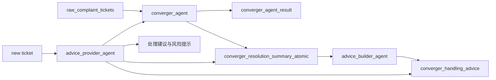

# 当前 Agent 架构

## 背景

项目已经从早期“分类表 + 标签表 + 关键词规则”的数据库驱动方案，收敛为以 AI Agent 为主的三段式流程。当前事实源是 `raw_complaint_tickets`、`converger_agent_result`、`converger_resolution_summary_atomic` 和 `converger_handling_advice`。

截至 2026-05-06，服务器上 `converger_agent` 已处理约 10 万条工单，分类和标签覆盖率接近全量。`advice_builder_agent` 已开始从历史处理摘要中生成处理建议，建议库可继续后台全量扩展。

## Agent 1：converger_agent

职责：

- 读取一条原始工单。
- 在受控分类和标签范围内输出结构化结果。
- 对有回单处理信息的历史工单提炼 `resolution_summary`。

输出：

- `primary_category`
- `request_tag`
- `emotion_tag`
- `risk_tag`
- `product_tag`
- `line_category`
- `resolution_summary`

落库：

- `converger_agent_result`
- `converger_resolution_summary_atomic`
- `raw_complaint_tickets.converger_agent_status`

状态：已实现，已在服务器批量运行。

## Agent 2：advice_builder_agent

职责：

- 按 `primary_leaf_code + product_tag_code + request_tag_code` 聚合历史 `resolution_summary`。
- 对高频场景生成 1 到 3 条可复用处理建议。
- 约束模型不得把个案金额、时限、套餐或减免结论泛化为通用承诺。

落库：

- `converger_handling_advice`

当前运行策略：

- `summary_count >= 100`
- `summary_count >= 50`
- `summary_count >= 20`

脚本默认跳过已生成 advice 的场景，可重复运行。

状态：已实现，服务器正在后台扩展建议库。

## Agent 3：advice_provider_agent

职责：

- 面向新工单生成处理建议。
- 先复用 `converger_agent` 得到分类和标签。
- 再检索 `converger_handling_advice`。
- 如果没有精确命中，则回退到同叶子分类、同产品、同诉求或历史摘要样本。
- 输出处理建议、适用条件、风险提醒、检索依据和置信度。

目标输出：

```json
{
  "ticket_id": "...",
  "classification": {
    "primary_leaf_code": "...",
    "primary_leaf_name": "...",
    "product_tag_code": "...",
    "product_tag_name": "...",
    "request_tag_code": "...",
    "request_tag_name": "...",
    "risk_tag_code": "...",
    "risk_tag_name": "...",
    "emotion_tag_code": "...",
    "emotion_tag_name": "..."
  },
  "matched_advices": [],
  "summary_samples": [],
  "recommended_actions": [],
  "risk_notes": [],
  "confidence": "high|medium|low",
  "needs_human_review": false
}
```

状态：待实现。

## 运行链路



## 验证方法

`advice_provider_agent` 的第一轮验证不应只看新工单。应选择已经生成过 `resolution_summary` 且已有 advice 命中的历史工单，隐藏处理过程字段，只保留投诉事实字段，让 provider 自己完成：

1. 分类和标签判断。
2. advice 检索。
3. 生成处理建议。
4. 对比历史 `resolution_summary` 和同场景 advice，判断方向是否一致。

遮蔽字段：

- `return_reason`
- `prov_dispatch_desc`
- `prov_process_desc`
- `city_process_desc`
- `process_dept`
- `flow_depts`

验证通过标准：

- 分类叶子、产品标签、诉求标签至少有 2 项命中历史结果。
- 能命中 `converger_handling_advice`。
- 建议不包含具体金额、到账时限、套餐名、减免承诺等未核实内容。
- 输出明确提示需要人工核实规则、证据或用户身份的场景。
