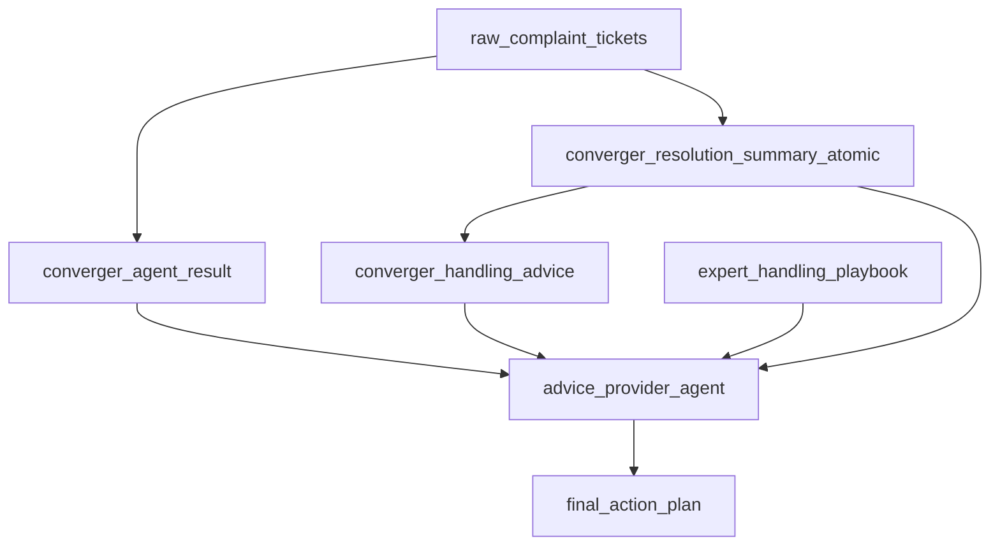

# 数据库表说明

本文档说明当前运行链路实际使用的核心表。远程库当前库名为 `voc`，本文只记录用途和字段含义，不记录密码。

## 核心表总览

| 表名 | 当前行数 | 主要写入方 | 主要读取方 | 用途 |
| --- | ---: | --- | --- | --- |
| `raw_complaint_tickets` | 104203 | 数据导入流程 | `converger_agent`、验证脚本 | 原始历史投诉工单。 |
| `converger_agent_result` | 103913 | `converger_agent` | `advice_provider_agent`、看板 | 每条工单的分类和标签结果。 |
| `converger_resolution_summary_atomic` | 28198 | `converger_agent` | `advice_builder_agent`、`advice_provider_agent` | 从历史处理过程提炼出的处理摘要。 |
| `converger_handling_advice` | 552 | `advice_builder_agent` | `advice_provider_agent` | 从历史摘要归纳出的可复用处理建议。 |
| `expert_handling_playbook` | 62 | 专家案例导入流程 | `advice_provider_agent` | 人工专家案例沉淀的处理剧本。 |

行数为 2026-05-16 从远程库只读核对的结果。

## raw_complaint_tickets

原始工单表，保存从业务系统导入的历史投诉数据。

关键字段：

- `ticket_id`：工单唯一 ID。
- `ticket_type`、`complaint_source`：工单类型和来源。
- `complaint_phenomenon`：投诉现象路径。
- `biz_category`、`line_category`：原系统业务分类和条线分类。
- `biz_content`：用户投诉正文。
- `return_reason`、`prov_dispatch_desc`、`prov_process_desc`、`city_process_desc`：历史处理过程和回单信息。
- `repeat_count`、`urge_count`、`oscillation_count`：重复、催单、震荡计数。
- `process_status`：原始处理状态。
- `converger_agent_status`：是否已被 `converger_agent` 批处理。

使用方式：

- 历史批处理时，`converger_agent` 读取此表。
- 面向新输入时，Chainlit 不写此表，而是构造临时 ticket payload。
- 验证 provider 时，会隐藏处理过程字段，只保留投诉事实字段。

## converger_agent_result

分类和标签结果表，一条工单通常对应一条收敛结果。

关键字段：

- `ticket_id`：关联原始工单。
- `primary_level1_code/name`、`primary_level2_code/name`、`primary_leaf_code/name`：主分类层级。
- `request_tag_code/name`：用户诉求标签。
- `emotion_tag_code/name`：情绪标签。
- `risk_tag_code/name`：风险标签。
- `product_tag_code/name`：产品标签。
- `line_category`：条线分类，通常沿用原始工单。
- `model_name`、`taxonomy_version`、`agent_version`：模型和分类体系版本。
- `status`：结果状态。

使用方式：

- `converger_agent` 写入。
- `advice_provider_agent` 在 `use_existing_classification=True` 时读取历史分类。
- 看板用于统计分类覆盖、标签分布和一致性。

## converger_resolution_summary_atomic

历史处理摘要表，记录从已处理工单中提炼出的可复用处理经验。

关键字段：

- `source_ticket_id`：摘要来源工单。
- `primary_leaf_code/name`、`product_tag_code/name`、`request_tag_code/name`：摘要所属场景。
- `risk_tag_code/name`、`emotion_tag_code/name`、`line_category`：辅助标签。
- `resolution_summary`：历史处理摘要。
- `model_name`、`taxonomy_version`、`agent_version`：生成版本。
- `status`：是否有效。

使用方式：

- `converger_agent` 从历史处理字段提炼并写入。
- `advice_builder_agent` 聚合同场景摘要，生成处理建议。
- `advice_provider_agent` 可展示同场景历史摘要样本作为附加依据。

## converger_handling_advice

历史建议库表，保存 `advice_builder_agent` 从摘要中归纳出的处理建议。

关键字段：

- `primary_leaf_code/name`：适用主分类。
- `product_tag_code/name`：适用产品标签。
- `request_tag_code/name`：适用诉求标签。
- `risk_tag_code/name`、`emotion_tag_code/name`、`line_category`：建议来源场景辅助信息。
- `advice_title`：建议标题。
- `advice_content`：建议步骤。
- `applicability_note`：适用条件和例外。
- `normalized_advice_hash`：去重哈希。
- `source_summary_count`：该建议归纳自多少条摘要。
- `latest_source_ticket_id`：最近来源工单。
- `status`：是否启用。

使用方式：

- `advice_builder_agent` 写入。
- `advice_provider_agent` 优先读取。
- 匹配优先级是：分类+产品+诉求精确命中，高于同分类同产品或同诉求的宽松命中。

## expert_handling_playbook

专家剧本表，保存人工案例中的高质量处理经验。当前已从 `热点投诉问题案例处理分享.xlsx` 导入 62 条。

关键字段：

- `scenario_key`：场景键。
- `title`：剧本标题。
- `case_description`：案例说明。
- `customer_type`、`repeat_type`、`province`：案例目录中的用户类型、投诉类型、来源省份。
- `source_file`、`source_sheet_name`、`source_case_no`、`source_case_title`：来源追溯字段。
- `trigger_keywords`：触发关键词 JSON 数组。
- `primary_leaf_code/name`、`product_tag_code/name`、`request_tag_code/name`：可选分类标签绑定。
- `verify_steps`：先核实事实步骤。
- `judgment_rules`：判断规则和责任。
- `execution_steps`：执行处理动作。
- `callback_requirements`：回访和回单要求。
- `communication_tips`：沟通技巧。
- `raw_case_text`：原始案例全文。
- `review_status`：审核状态，当前导入为 `reviewed`。
- `priority`：召回优先级，数值越小越优先。
- `status`：启用状态。

使用方式：

- `advice_provider_agent` 在历史建议库之后召回专家剧本。
- 召回要求主分类一致，或至少命中足够触发关键词，避免只因产品/诉求相同混入不相关案例。
- 专家剧本进入 `recommended_actions`，再由 `action_plan.py` 汇总成最终方案。

## 表之间的关系

## 新增专家案例的推荐流程

1. 将专家案例文件放在业务侧可追溯位置。
2. 抽取案例目录、背景、处理步骤、技巧和总结。
3. 导入或更新 `expert_handling_playbook`。
4. 先标记 `review_status='draft'` 或人工确认后标记 `reviewed`。
5. 用真实工单样本跑 `advice_provider_agent` 冒烟测试。
6. 确认召回不过宽、不跑偏后保持 `status='active'`。
