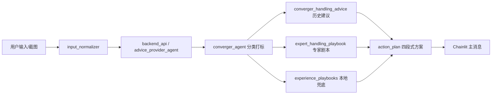

# VOC 项目地图

本文档是当前仓库的入口说明，用来回答三个问题：

- 代码目录分别放什么。
- 几个 Agent 分别负责什么。
- 新工单处理建议从哪里来、怎么组合。

## 当前有效目录

| 路径 | 作用 |
| --- | --- |
| `voc_agent/converger_agent/` | 历史工单收敛 Agent。负责分类、标签、处理摘要提取。 |
| `voc_agent/advice_builder_agent/` | 处理建议构建 Agent。负责把历史处理摘要归纳成可复用建议。 |
| `voc_agent/advice_provider_agent/` | 新工单建议 Agent。负责分类、召回历史建议、召回专家剧本、生成最终处理方案。 |
| `voc_agent/share/` | 共享工具，例如读取工单、读取启用分类/标签、结果映射。 |
| `voc_agent/core/` | 配置、数据库连接、LLM 客户端公共能力。 |
| `chainlit_app/` | 聊天式工单建议 UI，支持文本和图片转写输入。 |
| `backend_api/` | FastAPI 后端，封装 Agent、RAG 服务和后续管理 API。 |
| `progress_dashboard/` | Streamlit 数据看板，查看批处理覆盖、摘要质量、建议库覆盖情况。 |
| `deploy/scripts/` | 服务器批处理和验证脚本。 |
| `deploy/chainlit/` | Chainlit 服务部署脚本和上传清单。 |
| `sql_scripts/` | 当前有效 SQL 变更脚本。 |
| `OLD/` | 早期文档、旧 SQL、旧样例入口、旧验证材料归档，只作历史参考。 |

## 当前 Agent 分工

### 1. converger_agent

入口：

- `voc_agent/converger_agent/chain.py`
- `voc_agent/converger_agent/persistence.py`
- `deploy/scripts/run_converger_persist_quiet.py`
- `deploy/scripts/run_converger_persist_verbose.py`

职责：

- 从 `raw_complaint_tickets` 读取历史工单。
- 使用受控分类和标签体系输出结构化结果。
- 对有历史处理过程的工单提炼 `resolution_summary`。
- 将结果落库。

主要输出表：

- `converger_agent_result`
- `converger_resolution_summary_atomic`
- `raw_complaint_tickets.converger_agent_status`

### 2. advice_builder_agent

入口：

- `voc_agent/advice_builder_agent/builder.py`
- `deploy/scripts/run_advice_builder.py`

职责：

- 按 `primary_leaf_code + product_tag_code + request_tag_code` 聚合历史处理摘要。
- 让模型从同场景摘要中归纳 1 到 3 条可复用处理建议。
- 过滤个案金额、具体套餐、具体时限等不能泛化的内容。

主要输出表：

- `converger_handling_advice`

### 3. advice_provider_agent

入口：

- `voc_agent/advice_provider_agent/provider.py`
- `deploy/scripts/run_advice_provider.py`
- `chainlit_app/app.py`

职责：

- 面向新工单或临时输入生成处理建议。
- 调用 `converger_agent` 重新判断分类和标签。
- 召回历史建议库 `converger_handling_advice`。
- 召回专家剧本库 `expert_handling_playbook`。
- 叠加本地兜底剧本 `experience_playbooks.py`。
- 通过 `action_plan.py` 生成最终四段式处理方案。

最终输出重点：

- `classification`：分类和标签。
- `matched_advices`：历史建议库命中。
- `expert_playbooks`：专家案例命中。
- `recommended_actions`：候选处理动作。
- `final_action_plan`：给前台展示的可执行方案。
- `reply_standards`：回单规范提醒。
- `risk_notes`：人工复核风险提示。

### 4. advice_builder 和 advice_provider 的区别

| Agent | 面向对象 | 是否处理单个新投诉 | 主要产物 |
| --- | --- | --- | --- |
| `advice_builder_agent` | 历史摘要批量沉淀 | 否 | `converger_handling_advice` |
| `advice_provider_agent` | 当前新投诉 | 是 | `final_action_plan` |

## 新工单处理链路

## 文档维护约定

- 当前设计写在 `docs/` 根目录。
- 旧方案、旧 SQL、旧样例入口统一放在根目录 `OLD/`。
- 当前有效 SQL 变更脚本放在 `sql_scripts/`。
- 不要在文档里写真实数据库密码。
- 专家案例以后应导入 `expert_handling_playbook`，不要长期只写在代码里。
